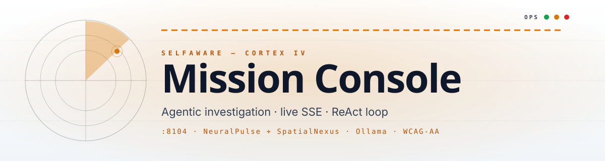

<p align="center">
  
</p>

# Autonomous-Cortex · Mission Console

> **Agentic investigation** — `POST /v1/investigate` returns a **Server-Sent Events** stream (`text/event-stream`): **thought** lines, **tool** calls to **NeuralPulse** + **SpatialNexus**, then an **answer** (Ollama synthesis when `OLLAMA_BASE_URL` is set). The **web** UI shows the brief in the main column and a live **tool timeline** in the sidebar.

| Spec | Value |
|---|---|
| **Theme** | Mission Console — amber alert + slate ops, Manrope + JetBrains Mono |
| **Port** | `:8104` |
| **Stack** | FastAPI · httpx · Vite · React 19 · Tailwind 4 · live SSE parser |

### Quick links
[API.md](docs/API.md) · [ARCHITECTURE.md](docs/ARCHITECTURE.md) · [PLAN.md](docs/PLAN.md) · [TESTING.md](docs/TESTING.md) · [UI.md](docs/UI.md) · [CHANGELOG.md](docs/CHANGELOG.md) · [SCREENSHOTS.md](docs/SCREENSHOTS.md) · [Suite — Ports & URLs](../docs/PORTS_AND_URLS.md)

### Open these to test

| What | Localhost | LAN |
|---|---|---|
| Swagger | http://127.0.0.1:8104/docs | http://&lt;LAN_IP&gt;:8104/docs |
| Health | http://127.0.0.1:8104/health | http://&lt;LAN_IP&gt;:8104/health |
| Tools | http://127.0.0.1:8104/v1/tools | http://&lt;LAN_IP&gt;:8104/v1/tools |
| Audit log | http://127.0.0.1:8104/v1/audit-log?limit=20 | http://&lt;LAN_IP&gt;:8104/v1/audit-log?limit=20 |
| UI | http://localhost:5173 | http://&lt;LAN_IP&gt;:5173 |


| | |
|--|--|
| **GitHub** | [Kimosabey/autonomous-cortex](https://github.com/Kimosabey/autonomous-cortex) |
| **Clone** | `git clone git@github.com:Kimosabey/autonomous-cortex.git` |
| **Default API port** | `8104` |
| **Stack** | FastAPI · httpx · **web:** Vite · React 19 · TS · Tailwind 4 · TanStack Query · RHF · Zod · Framer Motion · Sonner · fetch streaming parser |
| **Roadmap** | [docs/PLAN.md](docs/PLAN.md) |
| **UI / UX** | [docs/UI.md](docs/UI.md) |

---

## Repository layout

```
autonomous-cortex/
├── app/main.py              # SSE /v1/investigate, optional Ollama
├── web/
│   ├── src/pages/InvestigatePage.tsx
│   ├── src/lib/api.ts       # postInvestigateStream()
│   └── README.md
├── docs/
├── Dockerfile
├── docker-compose.yml
├── requirements.txt
├── .env.example
└── README.md
```

---

## Features

### API

| Method | Path | Description |
|--------|------|-------------|
| `GET` | `/health` | Liveness |
| `POST` | `/v1/investigate` | Body: `{ "message": string }`. Response: **SSE** stream of JSON objects in `data:` lines. `event` field values include `start`, `thought`, `tool`, `answer`, `done` |

`CORTEX_MODEL` selects the Ollama model for generation when LLM is used.

### Web UI

- Large **investigation brief** textarea + submit.
- Parses SSE in the browser; appends timeline entries.
- **Tool timeline** sidebar: thoughts + tools; primary **answer** card when `answer` event arrives.

---

## Environment variables

| Variable | Description |
|----------|-------------|
| `PORT` | Default `8104` |
| `OLLAMA_BASE_URL` | Optional Ollama base (no trailing slash) |
| `CORTEX_MODEL` | Default model id (e.g. `llama3.2`) |
| `CORS_ORIGINS` | Comma-separated allowed origins |

**Future integration (not consumed by current `main.py`):** `NEURAL_PULSE_BASE_URL`, `SPATIAL_NEXUS_BASE_URL` in [.env.example](.env.example) for when tools call sibling services.

**Web:** `VITE_API_BASE` — optional.

---

## Run locally

From the **repository root** (folder that contains `app/`), not inside `app/`.

**Windows:** `.\run-dev.ps1` or `run-dev.bat`.

```bash
# API
python -m venv .venv && .venv\Scripts\activate
pip install -r requirements.txt
python -m uvicorn app.main:app --reload --host 0.0.0.0 --port 8104

# Web (other terminal)
cd web && npm install && npm run dev
```

Proxy target: **127.0.0.1:8104**.

---

## Docker

```bash
docker compose up --build
```

---

## `web/` scripts

| Command | Purpose |
|---------|---------|
| `npm run dev` | Dev + HMR |
| `npm run build` | Typecheck + bundle |
| `npm run preview` | Preview |
| `npm run lint` | ESLint |

---

## SSE client notes

The UI uses **`fetch`** + **`ReadableStream`** (not `EventSource`) because the endpoint is **POST**. Chunks split on `\n\n` and lines starting with `data:`.

---

## License

Proprietary — Graylinx / SelfAware® unless otherwise stated.
