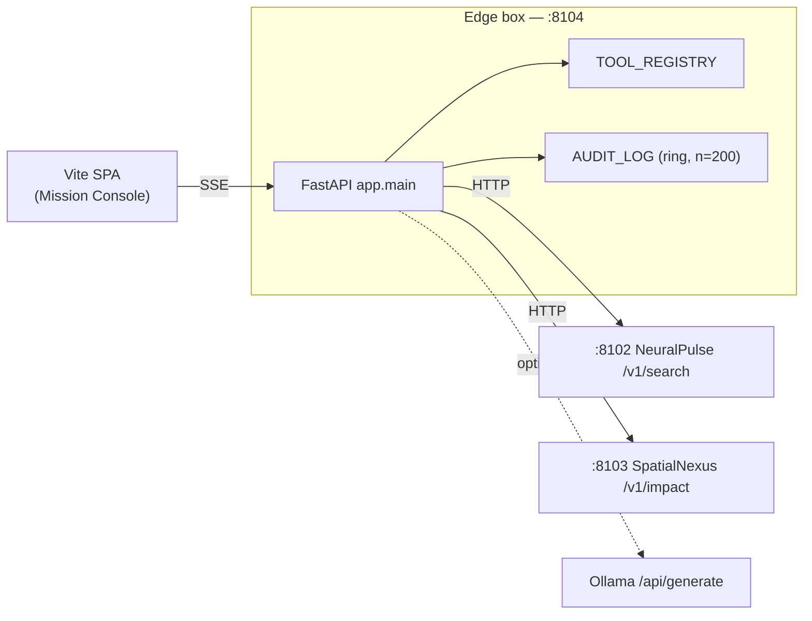
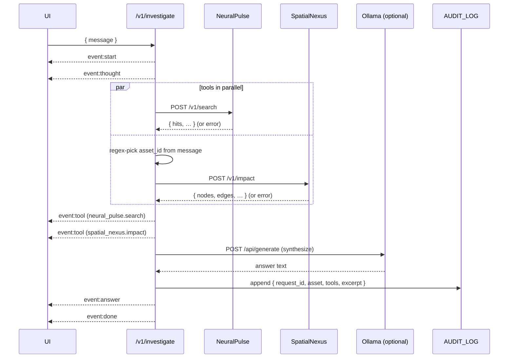

# Autonomous-Cortex — architecture

The Cortex is a small ReAct loop that calls **NeuralPulse** + **SpatialNexus**
over HTTP, then asks Ollama to synthesize. Read-only against field systems by
design — no control writes.

## Component diagram

## Investigation sequence

## Asset-ID resolution

The agent prefers the first regex match (`[A-Z]{2,10}-[A-Z0-9-]+`) in the user
message; falls back to part numbers from NeuralPulse hits; final fallback is
the demo seed `PUMP-A1` so SpatialNexus has something to bind against.

## Audit log

In-process `collections.deque(maxlen=200)`. Each completed investigation appends
`{request_id, ts, message_excerpt, asset_id, tools{hits|nodes|error}, answer_excerpt}`.
`GET /v1/audit-log` returns the most recent entries first. Resets on restart.

## Frontend

- **Mission Console** theme: amber + slate-ops, Manrope display, JetBrains Mono
  for tool payloads. Radar-sweep watermark, status LED row, dashed amber
  accents.
- SSE events drive a tool timeline on the right and an answer panel on the
  left.
- WCAG: skip-link, reduced-motion, focus rings, semantic landmarks, polite
  aria-live on the answer panel for screen readers.

## Failure modes (deliberate)

| Condition | Behaviour |
|---|---|
| NeuralPulse / SpatialNexus down | `event:tool` carries an `error` string; final synth acknowledges the failure |
| `OLLAMA_BASE_URL` unset | No synth; answer reports raw tool counts |
| All tools fail | Answer says "Investigation incomplete: all tools failed." |
